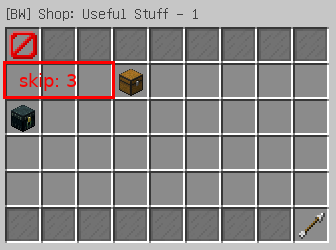
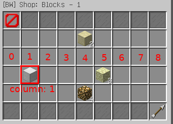
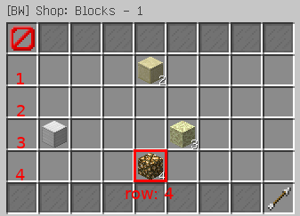
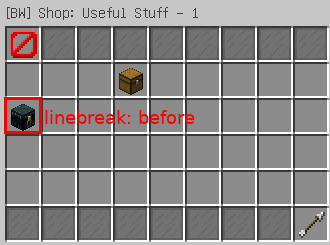
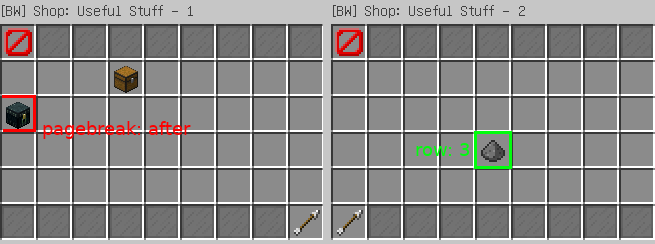

# Shop

The Screaming BedWars plugin uses our custom library, **SimpleInventories**, to create and render inventory-based GUIs, including shops. This article covers the basics of the shop item format. For more advanced features, see the [SimpleInventories Wiki](https://github.com/ScreamingSandals/SimpleInventories/wiki).

## Creating a new item

To create a new item, you need to know the item's internal name. You can look it up on the [Minecraft Wiki](https://minecraft.wiki). The name usually starts with `minecraft:`, but this prefix can be omitted.

In legacy environments (1.8.8–1.12.2), you can also use modern names. If they don’t work, refer to [this page](https://helpch.at/docs/1.12.2/org/bukkit/Material.html) for old material names. Keep in mind that old names are deprecated and may not be supported in future BedWars releases.

There are two supported formats for defining items: `short stack` and `long stack`.

### Using short stack

The short stack format supports only the material name, amount, display name, and lore. Except for the material, all parts are optional and separated by semicolons (`;`).

```yaml
items:
- stone
- dirt;2
- diamond_pickaxe;;Super Sword
- tnt;3;Trinitrotoluene;Does explode
```

To make the item purchasable, add `for <amount> <resource>`:

```yaml
items:
- stone for 1 bronze
- dirt;2 for 3 iron
- diamond_pickaxe;;Super Sword for 5 gold
- tnt;3;Trinitrotoluene;Does explode for 9 iron
```

In order to use additional attributes (like `properties` used for [Special items](specials.md)), simply convert the string format into a map with `stack` and `price` keys:

```yaml
items:
- stack: stone
  price: 1 bronze
- stack: dirt;2
  price: 3 iron
- stack: diamond_pickaxe;;Super Pickaxe
  price: 5 gold
- stack: tnt;3;Trinitrotoluene;Does explode
  price: 9 iron
```

### Using long stack

The long stack format allows full control over the item—enchantments, lore, display name, etc.

Let's see the previous example rewritten using long stacks:

```yaml
items:
- stack: 
    type: stone
  price: 1 bronze
- stack: 
    type: dirt
    amount: 2
  price: 3 iron
- stack: 
    type: diamond_pickaxe
    display-name: Super Pickaxe
  price: 5 gold
- stack: 
    type: tnt
    amount: 3
    display-name: Trinitrotoluene
    lore:
    - Does explode
  price: 9 iron
```

Now, let's enchant our Super Pickaxe with Fortune III.

```yaml
- stack: 
    type: diamond_pickaxe
    display-name: Super Pickaxe
    enchants:
      fortune: 3
  price: 5 gold
```

For enchantment names, refer to [this list](https://www.digminecraft.com/lists/enchantment_list_pc.php).

See [this page](https://github.com/ScreamingSandals/SimpleInventories/wiki/Variable:-stack) for a complete list of available options.

## Using item as a category

You can use any item as a category entry (even if the item is in another category). When players click the item, it opens the corresponding subcategory. This is simply done by adding a new list to our item called `items`. The format of `items` inside a category is the same as in the base `data` list.

```yaml
- stack: 
    type: diamond_pickaxe
    display-name: Super Pickaxes
    lore:
     - You will never mine with anything else!
  items:
    - wooden_pickaxe for 10 gold
    - golden_pickaxe for 20 gold
```

## Custom items

Sometimes, you may want to sell items that cannot be represented with long stack options alone. In such cases, use the `tag` field to define additional item data using SNBT (stringified NBT) format.

Example:

```yaml
- stack:
    type: diamond_pickaxe
    tag: '{Enchantments:[{lvl:3,id:fortune}]}'
```

This creates a diamond pickaxe with Fortune III. Keep in mind the tag format depends on the Minecraft version.

### Tag in newer versions

Since Minecraft 1.20.5, item data uses the new data components format. Here's how the same pickaxe would be defined in Minecraft 1.21.4:

```yaml
- stack:
    type: diamond_pickaxe
    tag: '{enchantments:{levels:{fortune:3}}}'
```

Note that this SNBT format required by `tag` differs slightly from the command format nowadays used in-game:

```
/give @a diamond_pickaxe[enchantments={levels:{fortune:3}}]
```

To convert such a command into valid tag format:

1. Extract the bracketed part:
    ```
    [enchantments={levels:{fortune:3}}]
    ```
2. Replace `[` at the beginning with `{` and `]` at the end with `}`:
    ```
    {enchantments={levels:{fortune:3}}}
    ```
3. Replace all top-level `=` signs with `:`:
    ```snbt
    {enchantments:{levels:{fortune:3}}}
    ```

Now you've got a valid value for the `tag` key.

### Upgrading items with tag

Because tags are version-specific, upgrading the server may break older tags. Since Screaming BedWars 0.2.27, you can add a `DataVersion` field to let the game upgrade the tag:

```yaml
- stack:
    type: diamond_pickaxe
    DataVersion: 1343
    tag: '{Enchantments:[{lvl:3,id:fortune}]}'
```

Here, `1343` is the data version for Minecraft `1.12.2`. The tag will be upgraded when having server on newer versions everytime the server is loaded. The file itself remains unchanged.

You can find Minecraft data versions on [this wiki page](https://minecraft.wiki/w/Data_version).

## Item Positioning

By default, items are rendered in order from left to right, top to bottom. However, SimpleInventories (and therefore Screaming BedWars) allows you to control the layout using positioning directives. These can help with alignment, spacing, and organizing items into rows, columns, or even multiple pages.

### `skip`

Skips a number of slots before placing the next item.

```yaml
- stack: chest for 1 bronze
  skip: 3
```



### `column` and `row`

Use these to place an item in a specific column or row. `column` starts from `0`, while `row` starts from `1`.
For `column`, you can also use special values: `left`, `center`, and `right` instead of a number.

```yaml
- stack: iron_block for 10 gold
  column: 1
- stack: glowstone for 5 iron
  row: 4
  column: center
```





### `linebreak`

Forces the next item to be placed on a new row. Think of it as pressing  "Enter" after an item.

There are three valid values for `linebreak`:
* `before` - Breaks the line before the item is rendered
* `after` - Breaks the line after the item is rendered
* `both` - Applies both `before` and `after`

```yaml
- stack: ender_chest for 5 iron
  linebreak: before
```



### `pagebreak`

Forces the next item to be placed on a new page.

Like `linebreak`, `pagebreak` accepts three values:
* `before` - Breaks the page before the item is rendered
* `after` - Breaks the page after the item is rendered
* `both` - Applies both `before` and `after`

```yaml
- stack: gunpowder for 5 iron
  pagebreak: before
  row: 3
```



### absolute (not recommended)

Places an item at an exact slot index (starting from `0`). This bypasses all automatic positioning logic and should only be used if you need full manual control.

```yaml
- stack: obsidian for 20 gold
  absolute: 13
```

This can make layouts harder to maintain and **is not recommended** unless absolutely necessary.
